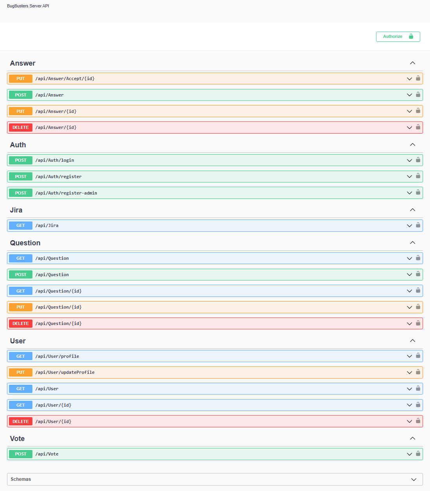

# BugBusters Server Application (API)

**BugBusters** is a company-specific developer panel designed for sharing issues and providing solutions. This application serves as a private version of StackOverflow, where employees within a company can ask questions, provide answers, and engage in community-driven problem-solving, without the concerns of public exposure.

## Features

- **User Management**: Registration, login, and profile management.
- **Roles**: Multiple user roles including Admin, Moderator, and User.
- **Q&A System**: Ask questions, answer them, and upvote/downvote content.
- **Admin Panel**: Admins can approve questions and answers before they go live.

## Technology Stack

- **Backend**: ASP.NET Core 7
- **Database**: SQL Server (MSSQL)
- **ORM**: Entity Framework Core (Code First, Migrations)
- **Logging**: Serilog
- **API Documentation**: Swagger
- **Authentication**: JWT
- **Mapping**: AutoMapper
- **Unit Testing**: NUnit, Moq
- **Architecture**: Clean Architecture, Repository Pattern
- **Best Practices**: Following industry standards and best practices

## Setup

### Prerequisites

- .NET 7 SDK
- SQL Server instance

### Installation

1. Clone this repository:
   ```bash
   git clone https://github.com/biswajitpanday/BugBusters.Server
   ```
2. Navigate to the solution directory and restore dependencies:
   ```bash
   cd BugBusters.Server
   dotnet restore
   ```
3. Apply migrations to set up the database schema:
   ```bash
   dotnet ef database update
   ```
4. Start the server:
   ```bash
   dotnet run
   ```

### Running Tests

To run the unit tests, use:
```bash
dotnet test
```

## Solution Structure

```plaintext
BugBusters.Server
├── External Sources
│   └── Tests
│       ├── BugBusters.Server.IntegrationTest
│       └── BugBusters.Server.UnitTest
├── BugBusters.Server.Api
│   ├── Connected Services
│   ├── Dependencies
│   ├── Properties
│   ├── Controllers
│   ├── Helpers
│   ├── Logs
│   ├── Middleware
│   ├── appsettings.json
│   └── Program.cs
├── BugBusters.Server.Core
│   ├── Dependencies
│   ├── Constants
│   ├── Converters
│   ├── Dtos
│   ├── Entities
│   ├── Enums
│   ├── Helpers
│   ├── Interfaces
│   ├── MapperHelper
│   └── Settings
│       └── AppSettings.cs
├── BugBusters.Server.Repository
│   ├── Dependencies
│   ├── Base
│   ├── DatabaseContext
│   ├── Migrations
│   ├── Seeder
│   ├── AnswerRepository.cs
│   ├── QuestionRepository.cs
│   └── VoteRepository.cs
├── BugBusters.Server.Service
│   ├── Dependencies
│   ├── AnswerService.cs
│   ├── CurrentUserService.cs
│   ├── JiraService.cs
│   ├── QuestionService.cs
│   ├── UserService.cs
│   └── VoteService.cs
```

## API Documentation (Swagger)

The API is documented using Swagger, which is accessible once the server is running. Below is a screenshot of the Swagger UI:



## Client Repository
The client-side code for this application can be found [here](https://github.com/biswajitpanday/BugBusters.Client).

## Contributing

1. Fork the repository.
2. Create a new branch.
3. Implement your changes and create a pull request.

## License

This project is licensed under the MIT License - see the [LICENSE](LICENSE) file for details.
